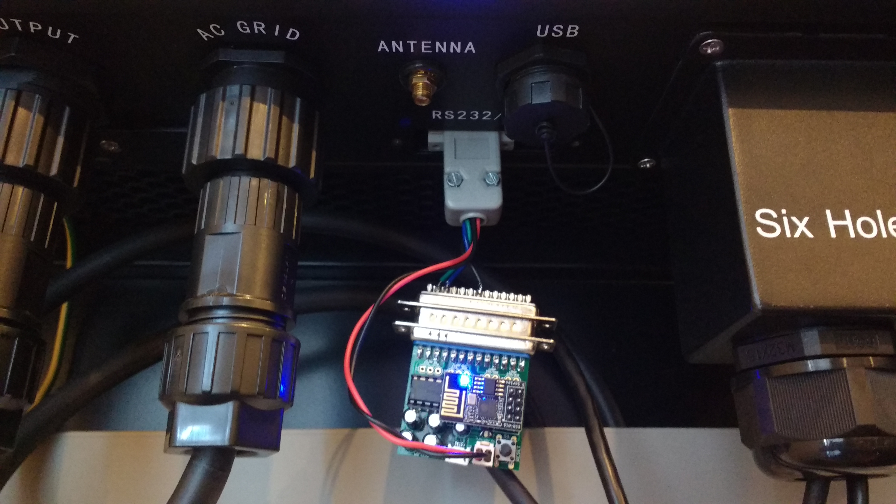
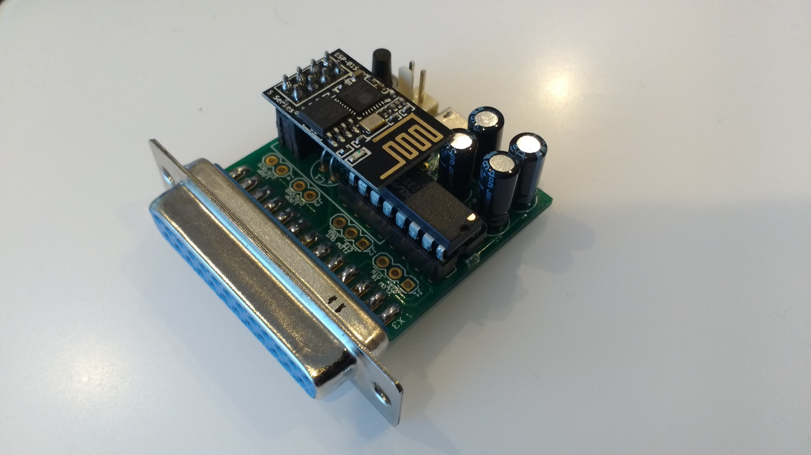
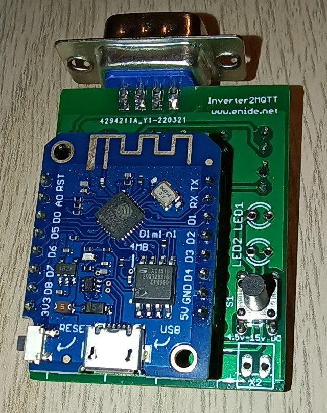
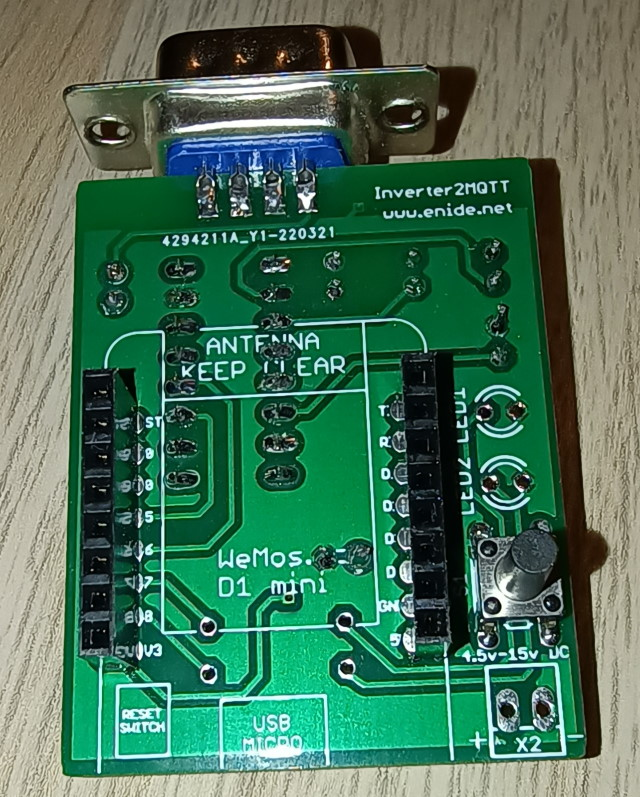
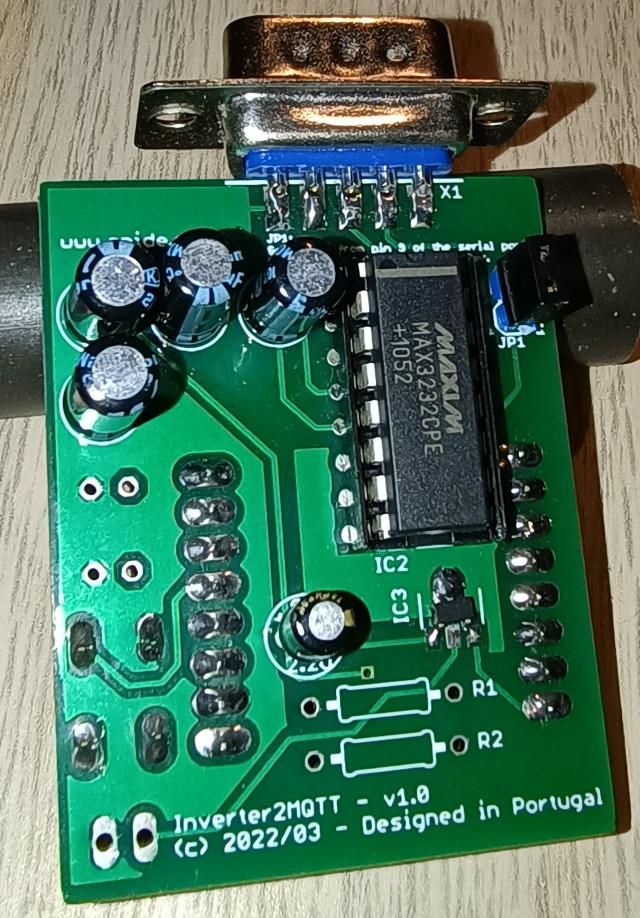
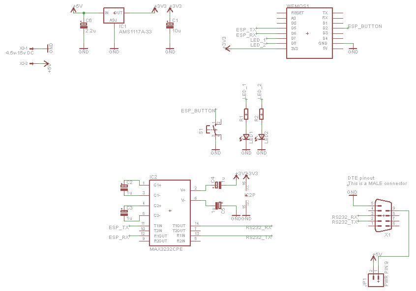
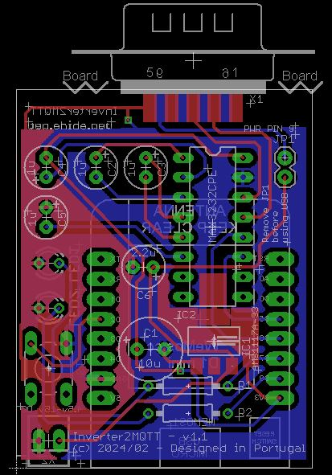

# Hardware
Any ESP8266 board should be able to run this software. 
The only thing needed, besides the ESP8266 board, is a MAX3232 or similar 3.3V RS232 level shifter and a 9 pin male D-Sub connector.

## ESP-01 / WiFi232 modem clone
I started this project using a clone of the [WiFi232 Modem](http://biosrhythm.com/?page_id=1453), with a custom 9 to 25 pin adapter, just to pass the TX, RX, GND and pin 9 (VCC from the inverter) to the WiFi232 modem.



This drawing shows the connections to the ESP-01 board I used as a guide:
```
    FROM INVERTER
-----------------------   2 = TX
\ (5) (4) (3) (2) (1) /   3 = RX
 \  (9) (8) (7) (6)  /    5 = GND
  \_________________/     9 = V+ (about 8 volts)


  Inverter DB9          Our DB9        ESP-01       ESP-01
  (female)              (male)         PCB          (pins)
     2 ---(TX)----(RX)--- 2 --MAX3232-- 4 ---(RX)--- RXD
     3 ---(RX)----(TX)--- 3 --MAX3232-- 5 ---(TX)--- TXD
     5 ---(GND)---------- 5 ----------- 1 ---------- GND
     9 ---(V+)----------- 9 ---VREG---- 8 ---------- VCC 

credit: https://github.com/jkairys/growatt-esp8266
```

## Wemos D1 mini and similar
Recently I decided to develop an adapter PCB, with all the components mentioned above and use a [Wemos D1 Mini](https://www.wemos.cc/en/latest/d1/d1_mini.html) board talk to the inverter via RS232 interface.

The Wemos D1 mini has a lot more pins and thus the serial communication to the inverter is handled by SoftwareSerial on pins D5 and D6, freeing the USB interface (native serial port) for sending log messages and debug information.

This new adapter board also includes 2 LEDs and one push button to use in the future.

Here's how the prototype looks like:


And how it looks without the Wemos D1 mini inserted:



This adapter board has since been updated with a new voltage regulator that is much easier to source. Below you will find the files needed to have it assembled.

The updated schematic:


The updated PCB:


- [Gerber files](docs/gerbers-02.zip)

## Your own solution
If you already have a ESP8266 board that can connect to a RS232 serial port, you should be able to use it as well.

Just make sure you're using pins D5 and D6 to talk to the inverter or alternatively, change those pins in the `setupInverter()` function of the [main file](growatt-sph-spa-esp8266.ino) and recompile everything.
