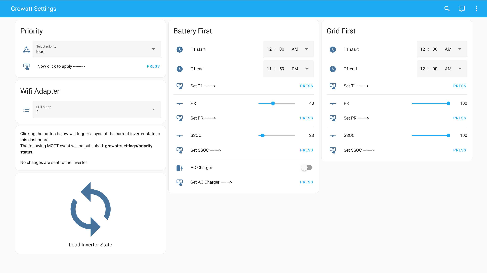

# Home Assistant entity configurations
If you use [Home Assistant](https://www.home-assistant.io/), here's a preconfigured list of all the MQTT sensors, to help you get started.

However, all inverter data is sent to a MQTT server of your choosing.
In no way you are required to run [Home Assistant](https://www.home-assistant.io/) to access it.

## Live data sensors (all data from input registers)
These sensors are what you'll need to get the data from the inverter in Home Assistant.
```
mqtt:
  sensor:
    - name: "Growatt Status"
      state_topic: "growatt/status"
      unit_of_measurement: ""
    - name: "Growatt Derate Mode"
      state_topic: "growatt/DerateMode"
      unit_of_measurement: ""
    - name: "Growatt Derate"
      state_topic: "growatt/Derate"
    - name: "Growatt Ppv1"
      state_topic: "growatt/Ppv1"
      unit_of_measurement: "W"
      state_class: measurement
      device_class: power
    - name: "Growatt Vpv1"
      state_topic: "growatt/Vpv1"
      unit_of_measurement: "V"
      state_class: measurement
      device_class: voltage
    - name: "Growatt Ipv1"
      state_topic: "growatt/Ipv1"
      unit_of_measurement: "A"
      state_class: measurement
      device_class: current
    - name: "Growatt Ppv2"
      state_topic: "growatt/Ppv2"
      unit_of_measurement: "W"
      state_class: measurement
      device_class: power
    - name: "Growatt Vpv2"
      state_topic: "growatt/Vpv2"
      unit_of_measurement: "V"
      state_class: measurement
      device_class: voltage
    - name: "Growatt Ipv2"
      state_topic: "growatt/Ipv2"
      unit_of_measurement: "A"
      state_class: measurement
      device_class: current
    - name: "Growatt Vac1"
      state_topic: "growatt/Vac1"
      unit_of_measurement: "V"
      state_class: measurement
      device_class: voltage
    - name: "Growatt Iac1"
      state_topic: "growatt/Iac1"
      unit_of_measurement: "A"
      state_class: measurement
      device_class: current
    - name: "Growatt Pac1"
      state_topic: "growatt/Pac1"
      unit_of_measurement: "VA"
      state_class: measurement
    - name: "Growatt Po"
      state_topic: "growatt/Pac"
      unit_of_measurement: "W"
      state_class: measurement
      device_class: power
    - name: "Growatt Fac"
      state_topic: "growatt/Fac"
      unit_of_measurement: "Hz"
      state_class: measurement
      device_class: frequency
    - name: "Growatt Daily Generated Energy"
      state_topic: "growatt/Etoday"
      unit_of_measurement: "kWh"
      state_class: total_increasing
      device_class: energy
    - name: "Growatt Total Generated Energy"
      state_topic: "growatt/Etotal"
      unit_of_measurement: "kWh"
      state_class: total_increasing
      device_class: energy
    - name: "Growatt Inverter Temp"
      state_topic: "growatt/Temp1"
      unit_of_measurement: "C"
    - name: "Growatt IPM Inverter Temp"
      state_topic: "growatt/Temp2"
      unit_of_measurement: "C"
    - name: "Growatt Boost Temp"
      state_topic: "growatt/Temp3"
      unit_of_measurement: "C"
    - name: "Growatt Priority"
      state_topic: "growatt/Priority"
      unit_of_measurement: ""
      device_class: "enum"
    # -------------------------------------
    - name: "Growatt Battery Type"
      state_topic: "growatt/Battery"
      unit_of_measurement: ""
      device_class: "enum"
    - name: "Growatt Battery Discharge Power"
      state_topic: "growatt/Pdischarge"
      unit_of_measurement: "W"
      state_class: measurement
      device_class: power
    - name: "Growatt Battery Charge Power"
      state_topic: "growatt/Pcharge"
      unit_of_measurement: "W"
      state_class: measurement
      device_class: power
    - name: "Growatt Battery Voltage"
      state_topic: "growatt/Vbat"
      unit_of_measurement: "V"
      state_class: measurement
      device_class: voltage
    - name: "Growatt Battery SOC"
      state_topic: "growatt/SOC"
      unit_of_measurement: "%"
      state_class: measurement
      device_class: battery
    # -------------------------------------
    - name: "Growatt EPS Fac"
      state_topic: "growatt/EpsFac"
      unit_of_measurement: "Hz"
      state_class: measurement
      device_class: frequency
    - name: "Growatt EPS Pac1"
      state_topic: "growatt/EpsPac1"
      unit_of_measurement: "W"
      state_class: measurement
      device_class: power
    - name: "Growatt EPS Vac1"
      state_topic: "growatt/EpsVac1"
      unit_of_measurement: "V"
      state_class: measurement
      device_class: voltage
    - name: "Growatt EPS Iac1"
      state_topic: "growatt/EpsIac1"
      unit_of_measurement: "A"
      state_class: measurement
      device_class: current
    - name: "Growatt EPS Load Percent"
      state_topic: "growatt/EpsLoadPercent"
      unit_of_measurement: "%"
    - name: "Growatt EPS PF"
      state_topic: "growatt/EpsPF"
```

## Settings (to change the holding registers)
You'll need this if you want to make changes to the inverter, from Home Assistant.
```
mqtt:
  binary_sensor:
    - name: "Growatt priority bat ac receiver"
      state_topic: "growatt/settings/priority/data"
      value_template: "{{ value_json.bat.ac }}"
      force_update: true
      payload_on: "on"
      payload_off: "off"
  sensor:
    # -------------------------------------
    - name: "Growatt priority select receiver"
      state_topic: "growatt/settings/priority/data"
      force_update: true
      value_template: >-
        
        {{ 'grid' }}
        
        {{ 'bat' }}
        
        {{ 'load' }}
        
    - name: "Growatt priority bat pr receiver"
      state_topic: "growatt/settings/priority/data"
      value_template: "{{ value_json.bat.pr }}"
      force_update: true
    - name: "Growatt priority bat ssoc receiver"
      state_topic: "growatt/settings/priority/data"
      value_template: "{{ value_json.bat.ssoc }}"
      force_update: true
    - name: "Growatt priority bat t1 start receiver"
      state_topic: "growatt/settings/priority/data"
      value_template: "{{ value_json.bat.t1[0:5] }}"
      force_update: true
    - name: "Growatt priority bat t1 end receiver"
      state_topic: "growatt/settings/priority/data"
      value_template: "{{ value_json.bat.t1[6:11] }}"
      force_update: true
    - name: "Growatt priority grid pr receiver"
      state_topic: "growatt/settings/priority/data"
      value_template: "{{ value_json.grid.pr }}"
      force_update: true
    - name: "Growatt priority grid ssoc receiver"
      state_topic: "growatt/settings/priority/data"
      value_template: "{{ value_json.grid.ssoc }}"
      force_update: true
    - name: "Growatt priority grid t1 start receiver"
      state_topic: "growatt/settings/priority/data"
      value_template: "{{ value_json.grid.t1[0:5] }}"
      force_update: true
    - name: "Growatt priority grid t1 end receiver"
      state_topic: "growatt/settings/priority/data"
      value_template: "{{ value_json.grid.t1[6:11] }}"
      force_update: true
  button:
    # -------------------------
    # set priority button
    - unique_id: growatt_set_priority_via_mqtt_button
      name: "Growatt Set Priority"
      command_topic: "growatt/settings/priority"
      command_template: "{{ states('input_select.growatt_priority_picker') }}"
      qos: 0
      retain: false
      entity_category: "config"
    # -------------------------
    # bat
    - unique_id: growatt_set_bat_time1_via_mqtt_button
      name: "Growatt Set Battery T1"
      command_topic: "growatt/settings/priority/bat/t1"
      command_template: "{{ states('input_datetime.growatt_bat_time1_on')[:5] }} {{ states('input_datetime.growatt_bat_time1_off')[:5] }}"
      qos: 0
      retain: false
      entity_category: "config"
    - unique_id: growatt_set_bat_pr_via_mqtt_button
      name: "Growatt Set Bat PR"
      command_topic: "growatt/settings/priority/bat/pr"
      command_template: "{{ states('input_number.growatt_input_bat_pr') | int }}"
      qos: 0
      retain: false
      entity_category: "config"
    - unique_id: growatt_set_bat_ac_via_mqtt_button
      name: "Growatt Set Bat AC"
      command_topic: "growatt/settings/priority/bat/ac"
      command_template: "{{ states('input_boolean.growatt_bat_first_ac_charger_enable') }}"
      qos: 0
      retain: false
      entity_category: "config"
    - unique_id: growatt_set_bat_ssoc_via_mqtt_button
      name: "Growatt Set Bat SSOC"
      command_topic: "growatt/settings/priority/bat/ssoc"
      command_template: "{{ states('input_number.growatt_input_bat_ssoc') | int }}"
      qos: 0
      retain: false
      entity_category: "config"
    # -------------------------
    # grid
    - unique_id: growatt_set_grid_time1_via_mqtt_button
      name: "Growatt Set Grid T1"
      command_topic: "growatt/settings/priority/grid/t1"
      command_template: "{{ states('input_datetime.growatt_grid_time1_on')[:5] }} {{ states('input_datetime.growatt_grid_time1_off')[:5] }}"
      qos: 0
      retain: false
      entity_category: "config"
    - unique_id: growatt_set_grid_pr_via_mqtt_button
      name: "Growatt Set Grid PR"
      command_topic: "growatt/settings/priority/grid/pr"
      command_template: "{{ states('input_number.growatt_input_grid_pr') | int }}"
      qos: 0
      retain: false
      entity_category: "config"
    - unique_id: growatt_set_grid_ssoc_via_mqtt_button
      name: "Growatt Set Grid SSOC"
      command_topic: "growatt/settings/priority/grid/ssoc"
      command_template: "{{ states('input_number.growatt_input_grid_ssoc') | int }}"
      qos: 0
      retain: false
      entity_category: "config"
    # -------------------------
    # growatt other settings
    - unique_id: growatt_read_all_priority_via_mqtt_button
      name: "Growatt Get All Priority"
      command_topic: "growatt/settings/priority"
      command_template: "{{ 'status' }}"
      qos: 0
      retain: false
      entity_category: "config"
  select:
    - unique_id: growatt_set_blue_led
      name: "Growatt Set Blue LED"
      command_topic: "growatt/settings/led"
      options:
        - "0"
        - "1"
        - "2"
      retain: true
      entity_category: "config"
```

## Dashboards
To get you started really quickly and reduce the amount of editing on your Home Assistant, below is a simplified dashboard, based on the one I have on my own Home Assistant to display all the entities from the inverter data.

```
title: Solar Power
views:
  - title: Solar Power
    path: solar-power
    icon: mdi:lightning-bolt
    badges: []
    cards:
      - type: horizontal-stack
        cards:
          - type: gauge
            entity: sensor.GRID_power
            min: 0
            max: 6900
            name: Grid Imported
            unit: W
            needle: true
            severity:
              green: 0
              yellow: 4600
              red: 5750
          - type: gauge
            entity: sensor.growatt_po
            min: 0
            max: 5000
            name: Growatt Injected
            unit: W
            needle: true
            severity:
              yellow: 4000
          - type: gauge
            entity: sensor.growatt_battery_soc
            min: 0
            max: 100
            name: Batery
            needle: true
            severity:
              green: 50
              yellow: 30
              red: 0
      - type: grid
        cards:
          - type: entities
            entities:
              - entity: sensor.growatt_vpv1
                icon: mdi:power-plug
                name: PV1 Volts
              - entity: sensor.growatt_ppv1
                icon: mdi:solar-power
                name: PV1 Watts
              - entity: sensor.growatt_ipv1
                icon: mdi:current-dc
                name: PV1 Amps
              - type: divider
              - entity: sensor.growatt_vpv2
                name: PV2 Volts
                icon: mdi:power-plug
              - entity: sensor.growatt_ppv2
                name: PV2 Watts
                icon: mdi:solar-power
              - entity: sensor.growatt_ipv2
                name: PV2 Amps
                icon: mdi:current-dc
            title: Solar Strings
          - type: vertical-stack
            cards:
              - type: history-graph
                entities:
                  - entity: sensor.growatt_ppv1
                    name: PV1 Watts
                  - entity: sensor.growatt_ppv2
                    name: PV2 Watts
                hours_to_show: 4
                refresh_interval: 0
        columns: 2
        square: true
      - type: grid
        cards:
          - type: entities
            entities:
              - entity: sensor.GRID_voltage
                icon: mdi:power-plug
                name: Volts
              - entity: sensor.GRID_power
                name: Active Pwr
                icon: mdi:lightning-bolt
              - entity: sensor.GRID_apparent_power
                name: Aparent Pwr
                icon: mdi:lightning-bolt
              - entity: sensor.GRID_current
                icon: mdi:current-ac
                name: Amps
              - entity: sensor.emeter_power_factor_template
                icon: mdi:percent
                name: Power Factor
            title: Grid
            show_header_toggle: false
          - type: entities
            entities:
              - entity: sensor.growatt_vac1
                icon: mdi:power-plug
                name: Volts
              - entity: sensor.growatt_po
                icon: mdi:lightning-bolt
                name: Active Pwr
              - entity: sensor.growatt_pac1
                name: Aparent Pwr
                icon: mdi:lightning-bolt
              - entity: sensor.growatt_priority
                icon: mdi:state-machine
                name: Priority
              - entity: sensor.growatt_status_template
                name: State
                icon: mdi:sign-real-estate
              - entity: sensor.growatt_derating
                name: Derating
            title: Growatt Inverter
        columns: 2
      - type: history-graph
        entities:
          - entity: sensor.GRID_power
            name: Grid Imported
          - entity: sensor.growatt_po
            name: Growatt Injection
        refresh_interval: 0
        title: Power (Grid & Solar)
        hours_to_show: 6
      - type: history-graph
        entities:
          - entity: sensor.growatt_battery_soc
            name: Pylontech
        hours_to_show: 24
        refresh_interval: 0
        title: Battery charge (24h)
      - type: horizontal-stack
        cards:
          - type: entity
            entity: sensor.growatt_battery_voltage
            icon: mdi:car-battery
            name: Volts
          - type: entity
            entity: sensor.pylontech_battery_instant_power
            name: Potência
            icon: mdi:lightning-bolt
            state_color: false
          - type: entity
            entity: sensor.growatt_battery_soc
            name: Carga
            icon: mdi:battery-high
      - type: grid
        cards:
          - type: entities
            entities:
              - entity: sensor.growatt_eps_vac1
                icon: mdi:power-plug
                name: Volts
              - entity: sensor.growatt_eps_iac1
                name: Current
              - entity: sensor.growatt_eps_pac1
                name: Aparent Pwr
                icon: mdi:lightning-bolt
              - entity: sensor.growatt_eps_load_percent
                name: Load
                icon: mdi:percent
              - entity: sensor.growatt_eps_pf
                name: Power Factor
                icon: mdi:percent
            title: EPS
          - type: vertical-stack
            cards:
              - type: gauge
                entity: sensor.growatt_eps_pac1
                min: 0
                max: 3000
                name: Active Pwr
              - type: gauge
                entity: sensor.growatt_eps_load_percent
                min: 0
                max: 100
                name: Load percentage
                severity:
                  green: 0
                  yellow: 50
                  red: 80
        columns: 2
      - type: history-graph
        entities:
          - entity: sensor.growatt_inverter_temp
            name: Inversor
          - entity: sensor.growatt_ipm_inverter_temp
            name: Inversor IPM
          - entity: sensor.growatt_boost_temp
            name: Inversor Boost
        hours_to_show: 24
        refresh_interval: 0
        title: Temperatura
      - type: vertical-stack
        cards:
          - type: entities
            entities:
              - entity: input_select.growatt_priority_picker
                name: Select priority
                icon: mdi:state-machine
              - entity: button.growatt_set_priority
                name: Now click to apply -------->
  
```

and the dashboard to change the inverter parameters:


```
title: Growatt Settings
views:
  - title: Settings
    path: settings
    icon: mdi:cog
    badges: []
    cards:
      - type: vertical-stack
        cards:
          - type: entities
            entities:
              - entity: input_select.growatt_priority_picker
                name: Select priority
                icon: mdi:state-machine
              - entity: button.growatt_set_priority
                name: Now click to apply -------->
            title: Priority
      - type: vertical-stack
        cards:
          - type: entities
            entities:
              - entity: select.growatt_set_blue_led
                name: LED Mode
            title: Wifi Adapter
      - type: vertical-stack
        cards:
          - type: entities
            entities:
              - entity: input_datetime.growatt_bat_time1_on
                name: T1 start
              - entity: input_datetime.growatt_bat_time1_off
                name: T1 end
              - entity: button.growatt_set_battery_t1
                name: Set T1 -------->
              - type: divider
              - entity: input_number.growatt_input_bat_pr
                name: PR
              - entity: button.growatt_set_bat_pr
                name: Set PR -------->
              - type: divider
              - entity: input_number.growatt_input_bat_ssoc
                name: SSOC
              - entity: button.growatt_set_bat_ssoc
                name: Set SSOC -------->
              - type: divider
              - entity: input_boolean.growatt_bat_first_ac_charger_enable
                name: AC Charger
              - entity: button.growatt_set_bat_ac
                name: Set AC Charger -------->
            title: Battery First
      - type: vertical-stack
        cards:
          - type: entities
            entities:
              - entity: input_datetime.growatt_grid_time1_on
                name: T1 start
              - entity: input_datetime.growatt_grid_time1_off
                name: T1 end
              - entity: button.growatt_set_grid_t1
                name: Set T1 -------->
              - type: divider
              - entity: input_number.growatt_input_grid_pr
                name: PR
              - entity: button.growatt_set_grid_pr
                name: Set PR -------->
              - type: divider
              - entity: input_number.growatt_input_grid_ssoc
                name: SSOC
              - entity: button.growatt_set_grid_ssoc
                name: Set SSOC -------->
            title: Grid First
      - type: vertical-stack
        cards:
          - type: markdown
            content: >-
              Clicking the button below will trigger a sync of the current
              inverter state to this dashboard.

              The following MQTT event will be published:
              **growatt/settings/priority status**. 


              No changes are sent to the inverter.
          - show_name: true
            show_icon: true
            type: button
            tap_action:
              action: toggle
            entity: button.growatt_get_all_priority
            icon: mdi:sync
            name: Load Inverter State
            hold_action:
              action: none

```