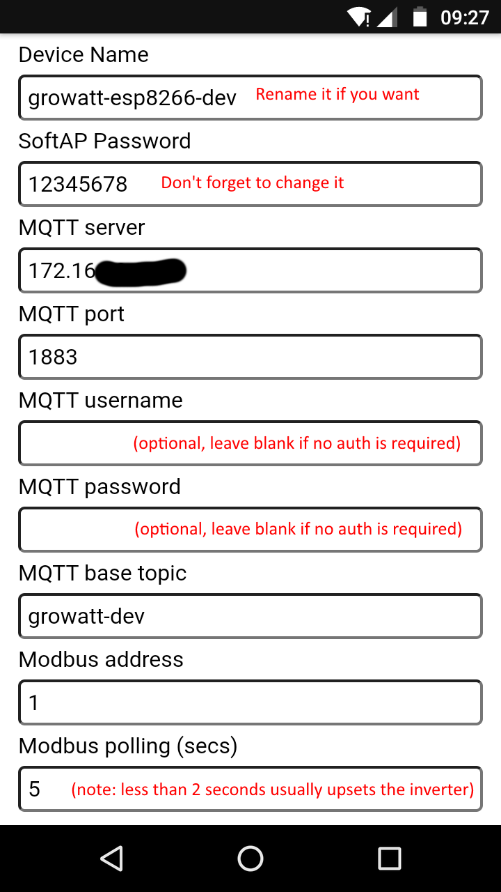

# growatt-sph-spa-esp8266
This project's main goal is to read energy data from a **Growatt SPH** or **Growatt SPA** inverter and publish it to a MQTT server of your choice.
It can run on many ESP8266 boards like NodeMCU v3, Wemos D1 or even ESP-01, etc. because it doesn't require anything besides the ESP chip and a serial port MAX3232 level converter.

The data published to the MQTT server can be consumed by almost any Home Automation solution.

Many ideas to implement this project came from other projects, most notably:
- [growatt-esp8266](https://github.com/jkairys/growatt-esp8266)
- [growatt-rs232-reader](https://github.com/lemval/growatt-rs232-reader)

## Main features
- Configuration fully done via captive portal or web interface
- Periodically polls data from the inverter and publishes it to the MQTT server via Wifi
- Polling period is configurable (in seconds)
- You can change inverter settings via MQTT:
- - **Priority**: load, battery, grid
- - **Time intervals** (eg 00:00 - 23:59) for battery and grid priorities
- - Enable/Disable the **AC Charger**
- - Set **StopStateOfCharge** for battery and grid priorities
- - Set **PowerRating** for battery and grid priorities
- Prebuilt binaries for NodeMCU/WemosD1 and Generic ESP-01 ESP8266 modules, ie no need to recompile the code
- No cloud, all energy data is under your control

## Downloading a pre-built binary
There are currently two pre-built binary files available:
- `generic`: for ESP-01 boards as it uses the hardware serial to communicate with the inverter
- `d1mini`: for NodeMCU/WemosD1 and larger boards, it uses a SoftwareSerial port on pins D5 and D6 to communicate with the inverter... the USB port is used for log messages

### Build instructions
See [BUILD.md](BUILD.md) for more details, if you really want to compile it on your own.

## Configuration
Everything is *configured via WiFiManager's Captive Portal / Web Portal* and stored in the SPIFFS file system, in a JSON file.
So when powering up the board for the first time, after uploading the firmware, you'll be presented with a WiFi network named `growatt-sph-spa-esp8266` from where you can select to which network the board should connect to and the remaining settings.
### The main screen

### The WiFi settings screen

### The setup screen with the remaining settings

##
After that initial setup is complete, you will still be able to access the configuration portal on the IP address assigned to the board, on the network it's connected to, and make changes to the configuration. All parameters can be changed on the fly without the need for a restart, except for the `Device name` which requires a restart because it is used on DHCP requests and WiFi SoftAP.

### MQTT
The complete list of MQTT topics used by this project is available in the [topics](TOPICS.md) file.
If you use Home Assistant, you can grab the list of preconfigured sensor entities from [the home assistant](HOMEASSISTANT.md) file to help you out.

## Hardware
This project runs on any generic ESP8266 board, as long as you provide the means to interface it to the inverter serial port, using a MAX3232 or similar chip.
Look in the [hardware](HARWARE.md) file for more details on how to connect an ESP8266 board to the Growatt SPH inverter.

